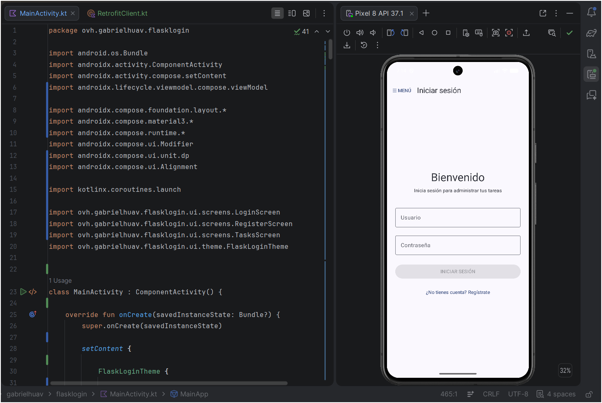
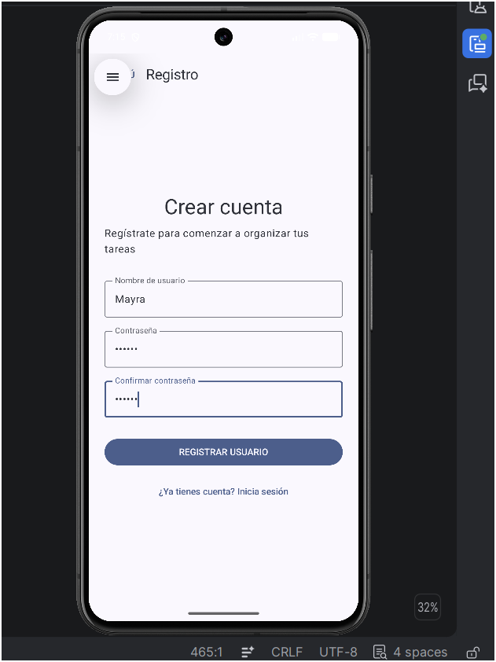
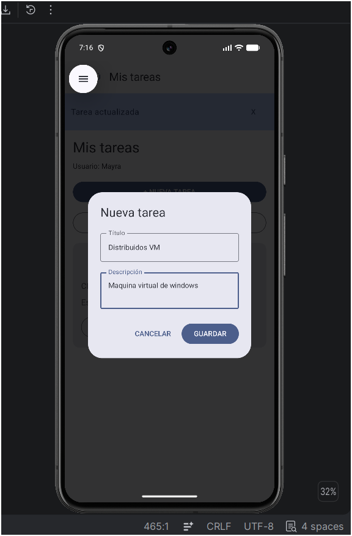
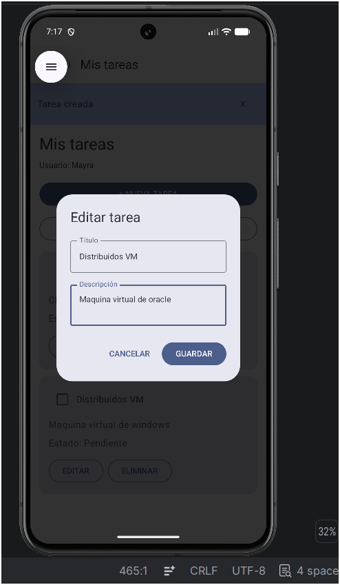
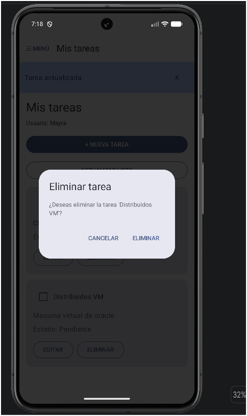
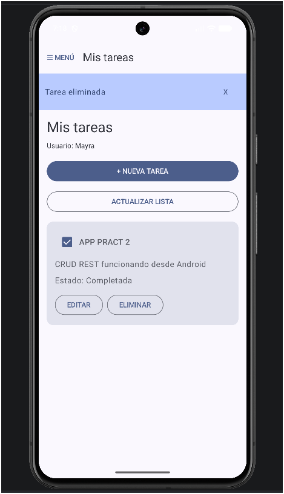
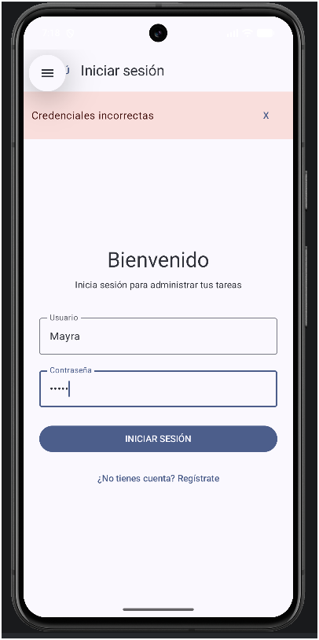

<div align="center">

# PRÁCTICA 2

## Aplicación móvil CRUD con servicio REST

### Android · Kotlin · Flask · Docker · SQLite

<br>

**DESARROLLO DE APLICACIONES MÓVILES NATIVAS**


<br>


<br>

---

### DATOS ACADÉMICOS


| <p align=center> Instituto Politécnico Nacional </center>|
|:---|
|  <p align=center>Escuela Superior de Cómputo |
|  <p align=center>Ingeniería en Sistemas Computacionales |
|  <p align=center>Mayra Solis Lugo |
|  <p align=center> 2023630449 |
| <p align=center> Grupo: 7CV4 </center> |
| <p align=center> Profesor: Gabriel Hurtado Áviles |
| <p align=center> Fecha de entrega: 18/09/2026 |

---

**Repositorio de prácticas de Aplicaciones Móviles**

</div>

<br>

## Introducción
<div align=justify>
Esta práctica consiste en desarrollar una aplicación Android que permite registrar usuarios, iniciar sesión y administrar tareas mediante operaciones CRUD (crear, consultar, actualizar y eliminar). La aplicación está desarrollada en **Kotlin con Jetpack Compose y Material 3** y se comunica mediante **Retrofit/OkHttp** con una API REST implementada en **Python y Flask**. El servicio se ejecuta en un contenedor de **Docker**, utiliza **SQLAlchemy** como ORM y **SQLite** como base de datos. Para la autenticación se emplean contraseñas almacenadas mediante hash con sal usando **bcrypt** y tokens **JWT** para acceder a las rutas protegidas.

Se eligió esta combinación porque separa la interfaz móvil, la lógica del servidor y la persistencia; además, Docker Compose permite reconstruir el backend sin instalar Python ni sus dependencias directamente en la computadora de evaluación. El recurso seleccionado para el CRUD es **tareas**, con título, descripción y estado de realización.

**Punto de partida:** este trabajo se basó en el repositorio de ejemplo [gabrielhuav/Flask-Compose-Login-API](https://github.com/gabrielhuav/Flask-Compose-Login-API). El ejemplo contenía registro e inicio de sesión en Flask y una aplicación Android base. Se extendió con los endpoints CRUD de tareas, protección mediante JWT, configuración de entorno y persistencia; en Android se implementaron la conexión real con Retrofit, los modelos de datos, el ViewModel, las pantallas de registro/login/tareas y el menú lateral. El código de esta práctica se mantiene en el repositorio propio de la materia y no modifica el repositorio original.

## 2. Desarrollo

### 2.1. Conceptos utilizados

**Docker.** Permite empaquetar el backend y sus dependencias en una imagen ejecutable en un entorno aislado. A diferencia de una máquina virtual completa, un contenedor comparte el kernel del sistema anfitrión.

**Imagen y contenedor.** La imagen es la plantilla construida a partir del Dockerfile; el contenedor es su instancia en ejecución. La información que debe sobrevivir a la recreación del contenedor se conserva en almacenamiento persistente.

**Dockerfile.** Define cómo construir la imagen del servicio: imagen base de Python, directorio de trabajo, instalación de paquetes, copia de código, puerto y comando de arranque.

**Docker Compose.** Describe y levanta el servicio, su puerto publicado, las variables de entorno y el volumen de SQLite con `docker compose up --build`.

**API REST.** Recibe solicitudes HTTP, valida sus datos y responde en JSON. En esta práctica se emplean `POST`, `GET`, `PUT` y `DELETE`, además de códigos HTTP como `200`, `201`, `400`, `401` y `404` según el resultado.

**ORM y SQLite.** SQLAlchemy representa las tablas como modelos de Python; SQLite guarda los registros en un archivo, sin requerir un servidor de base de datos independiente.

**Hash y JWT.** bcrypt genera y verifica hashes de contraseña; no se almacena la contraseña original. Tras un login válido, Flask entrega un JWT firmado y con expiración que Android envía en `Authorization: Bearer <token>` para solicitar las operaciones protegidas. Un JWT firmado **no cifra** su contenido.

### 2.2. Organización del proyecto

```text
Practica2-CRUD-REST/
├── Android/
│   └── FlaskLogin/                 # Proyecto de Android Studio
│       └── app/src/main/java/ovh/gabrielhuav/flasklogin/
│           ├── MainActivity.kt    # Menú y navegación
│           ├── AppViewModel.kt    # Estado, autenticación y CRUD
│           ├── data/              # Modelos, API y cliente Retrofit
│           └── ui/screens/        # Login, registro y tareas
├── Docker-Flask/
│   └── ORM/
│       ├── app.py                 # API Flask
│       ├── requirements.txt       # Dependencias Python
│       ├── Dockerfile
│       ├── docker-compose.yml
│       └── .env.example           # Nombres de variables, sin secretos
├── docs/
│   └── img/                       # Evidencias de la práctica
└── README.md
```

> Los directorios `.gradle/`, `build/`, `.idea/` y el archivo `local.properties` son generados localmente. No se deben publicar `.env`, archivos `*.db` ni secretos. Compruebe que los archivos de configuración y las capturas no contengan contraseñas o tokens reales.

### 2.3. Instalación y ejecución reproducible

**Requisitos:** Git, Docker Desktop con Docker Compose, Android Studio con Android SDK y un emulador Android configurado. Para **levantar solamente el backend**, basta con Docker y Git (o descargar el repositorio como ZIP).

1. Clonar el repositorio:

   ```powershell
   git clone https://github.com/MXYSL/Aplicaciones-Moviles.git
   cd Aplicaciones-Moviles/Practica2-CRUD-REST/Docker-Flask/ORM
   ```

2. Crear la configuración local a partir de la plantilla:

   ```powershell
   Copy-Item .env.example .env
   ```

   Abrir `.env` y completar los valores solicitados por `.env.example`. Generar una clave JWT aleatoria y suficientemente larga; **no copiar al repositorio el archivo `.env` real**. En sistemas distintos de PowerShell puede usarse `cp .env.example .env`.
### Configuración de las variables de entorno

Por motivos de seguridad, el archivo `.env`, que contiene la clave utilizada para firmar y validar los tokens JWT, no se incluye en el repositorio.

Para ejecutar el backend después de clonar el proyecto, es necesario crear un archivo `.env` a partir de `.env.example` y configurar una clave privada propia.

**Paso 1. Acceder al directorio del backend**

Desde la raíz del repositorio:

```powershell
cd Practica2-CRUD-REST/Docker-Flask/ORM
```

**Paso 2. Crear el archivo `.env`**

En PowerShell:

```powershell
Copy-Item .env.example .env
```

Este comando genera una copia del archivo de ejemplo, conservando el nombre de la variable que necesita Flask:

```dotenv
JWT_SECRET_KEY=coloca_aqui_una_clave_segura
```

**Paso 3. Generar una clave JWT segura**

Ejecutar:

```powershell
python -c "import secrets; print(secrets.token_hex(32))"
```

El comando genera una clave aleatoria de 64 caracteres hexadecimales.

**Paso 4. Configurar la clave privada**

Abrir el archivo `.env`:

```powershell
notepad .env
```

Reemplazar `coloca_aqui_una_clave_segura` por la clave generada en el paso anterior:

```dotenv
JWT_SECRET_KEY=CLAVE_GENERADA_EN_EL_PASO_ANTERIOR
```

Guardar el archivo. No es necesario modificar `.env.example`.

> **Nota de seguridad:** cada persona que clone el repositorio debe generar su propia clave. El archivo `.env` está excluido mediante `.gitignore` para evitar que las claves privadas se publiquen en GitHub.

**Paso 5. Construir y ejecutar el backend**

Desde el mismo directorio:

```powershell
docker compose up --build
```

Docker Compose cargará automáticamente las variables del archivo `.env`, construirá la imagen y ejecutará el servicio Flask en el puerto `5000`.

Para comprobar que el backend está disponible:

```powershell
curl.exe http://localhost:5000/
```

La respuesta esperada es:

```json
{
  "message": "API REST funcionando"
}
```
3. Construir y levantar el backend:

   ```powershell
   docker compose up --build
   ```

   El comando construye la imagen, crea el contenedor y prepara el almacenamiento definido en Compose. Mantener esta terminal abierta mientras se usa la aplicación.

4. Verificar desde otra terminal:

   ```powershell
   curl.exe http://localhost:5000/
   ```

   Respuesta observada durante las pruebas:

   ```json
   {"message":"API REST funcionando"}
   ```

5. Abrir el proyecto **`Android/FlaskLogin`** en Android Studio, esperar la sincronización de Gradle, seleccionar el emulador **Pixel 8** y ejecutar la configuración **app**. Si la carpeta Android tiene un nombre diferente al mostrado, abrir aquella que contiene `settings.gradle.kts` y `app/`.

6. La URL base para el emulador es **`http://10.0.2.2:5000/`**, no `http://localhost:5000/`: dentro del emulador, `localhost` se refiere al propio Android. La URL se configura en `data/RetrofitClient.kt`. Para un teléfono físico en la misma red, usar la IP local de la computadora y revisar el firewall.

7. Para detener el servicio sin borrar los datos:

   ```powershell
   docker compose down
   ```

   **No ejecutar `docker compose down -v` si se desea conservar la base SQLite**, porque la opción `-v` elimina los volúmenes del proyecto.

### 2.4. Dockerfile y Docker Compose

El Dockerfile del ejemplo parte de `python:3.9-slim`. `FROM` selecciona la imagen base; `WORKDIR /app` establece la carpeta de trabajo; `COPY requirements.txt .` copia las dependencias antes que el resto del proyecto para aprovechar la caché; `RUN pip install --no-cache-dir -r requirements.txt` instala Flask y sus extensiones; `COPY . .` agrega el código; `EXPOSE 5000` documenta el puerto del proceso; `CMD ["python", "app.py"]` inicia el backend.

En `docker-compose.yml`, `services` define el servicio Flask; `build: .` utiliza el Dockerfile de esa carpeta; `ports: "5000:5000"` conecta el puerto 5000 del equipo anfitrión con el del contenedor; la configuración de entorno entrega los secretos sin incrustarlos en el código; y el volumen de SQLite permite conservar usuarios y tareas después de detener o recrear el contenedor. **Revisar los nombres exactos de las variables y del volumen en los archivos entregados antes de publicar este README.**

### 2.5. Endpoints REST

**URL desde la computadora:** `http://localhost:5000`  
**URL desde el emulador Android:** `http://10.0.2.2:5000`

| Método | Ruta | Descripción | Autenticación | Respuesta esperada |
|---|---|---|---|---|
| GET | `/` | Verifica que la API esté activa | No | `200` |
| POST | `/register` | Registra un usuario | No | `201`; `400` si los datos no son válidos o el usuario ya existe |
| POST | `/login` | Verifica credenciales y devuelve JWT | No | `200`; `401` si las credenciales son incorrectas |
| GET | `/tasks` | Consulta las tareas | JWT | `200`; `401` sin token válido |
| POST | `/tasks` | Crea una tarea | JWT | `201`; `400` si los datos no son válidos |
| PUT | `/tasks/{id}` | Actualiza título, descripción o estado | JWT | `200`; `404` si no existe |
| DELETE | `/tasks/{id}` | Elimina una tarea | JWT | `200`; `404` si no existe |

**Registro — `POST /register`:**

```json
{"username":"usuario_demo","password":"CLAVE_DE_PRUEBA"}
```

Respuesta de ejemplo:

```json
{"message":"Usuario creado exitosamente"}
```

**Inicio de sesión — `POST /login`:** se envía el mismo JSON; ante credenciales correctas la respuesta contiene `access_token`, `message` y `username`. Se omite el valor real del token en esta documentación.

```json
{"access_token":"<JWT_GENERADO>","message":"Login exitoso","username":"usuario_demo"}
```

**Crear — `POST /tasks`:**

```http
Authorization: Bearer <JWT_GENERADO>
Content-Type: application/json
```

```json
{"titulo":"APP PRACT 2","descripcion":"CRUD REST funcionando desde Android"}
```

Respuesta de ejemplo (`201`):

```json
{"message":"Tarea creada","task":{"id":1,"titulo":"APP PRACT 2","descripcion":"CRUD REST funcionando desde Android","completada":false}}
```

**Consultar — `GET /tasks`:**

```json
{"tasks":[{"id":1,"titulo":"APP PRACT 2","descripcion":"CRUD REST funcionando desde Android","completada":true}]}
```

**Actualizar — `PUT /tasks/1`:**

```json
{"titulo":"APP PRACT 2","descripcion":"CRUD REST funcionando desde Android","completada":true}
```

Respuesta de ejemplo:

```json
{"message":"Tarea actualizada","task":{"id":1,"titulo":"APP PRACT 2","descripcion":"CRUD REST funcionando desde Android","completada":true}}
```

**Eliminar — `DELETE /tasks/1`:**

```json
{"message":"Tarea eliminada"}
```

Los identificadores son ilustrativos y dependen de la base de datos generada en cada instalación.

### 2.6. Interfaz móvil y evidencias

La aplicación contiene una pantalla de inicio de sesión, otra de registro y una pantalla para administrar tareas. El menú lateral permite navegar y cerrar sesión. La interfaz informa los resultados de las operaciones mediante mensajes de éxito o error y muestra el estado de carga cuando se comunica con la API.

**Figura 1. Pantalla de inicio de sesión y proyecto Android en ejecución.**



**Figura 2. Formulario de registro de usuario.** Los caracteres de contraseña aparecen ocultos.



**Figura 3. Creación de una tarea.** Se ingresan título y descripción desde el emulador.



**Figura 4. Edición de una tarea.** Se modifica la descripción de un registro existente.



**Figura 5. Confirmación de eliminación.** La aplicación solicita confirmar antes de borrar.



**Figura 6. Consulta de tareas y mensaje de eliminación exitosa.** La lista conserva otra tarea registrada, lo que evidencia que se eliminó el registro seleccionado y no toda la información.



**Figura 7. Credenciales incorrectas.** El backend rechaza el inicio de sesión y Android muestra el error.



### 2.7. Pruebas de calidad (QA)

| Prueba | Procedimiento | Resultado observado |
|---|---|---|
| Disponibilidad | `GET /` desde PowerShell | `200` y mensaje `API REST funcionando` |
| Registro | Crear un usuario desde Android | Registro exitoso; usuario disponible en un inicio de sesión posterior |
| Login válido | Ingresar credenciales registradas | Acceso a la pantalla de tareas |
| Crear | Capturar título y descripción y guardar | La tarea aparece en la lista |
| Leer | Abrir o actualizar la lista | Se muestran los registros guardados |
| Actualizar | Editar título/descripción o marcar completada | La tarjeta refleja los cambios |
| Eliminar | Confirmar la eliminación | Mensaje `Tarea eliminada`; desaparece la tarea seleccionada |
| Login inválido | Enviar una contraseña incorrecta | `401` en prueba de API; mensaje `Credenciales incorrectas` en Android |
| CRUD sin autenticación | `GET /tasks` sin encabezado Authorization | `401 UNAUTHORIZED` y `Missing Authorization Header` |
| Persistencia | Detener el contenedor y volver a iniciarlo sin borrar el volumen | Los usuarios registrados siguen disponibles |

**Alcance de seguridad:** bcrypt protege las contraseñas almacenadas y el JWT controla el acceso a los endpoints CRUD. El token se conserva en memoria en la implementación Android actual y se descarta al cerrar sesión; no se implementó persistencia cifrada de la sesión tras cerrar completamente la aplicación. La conexión `http://10.0.2.2:5000/` se usa **solo para desarrollo local**: HTTP no cifra las credenciales en tránsito. Un despliegue accesible desde redes externas requiere HTTPS/TLS, desactivar el modo debug de Flask y revisar medidas adicionales de revocación de tokens, limitación de intentos y endurecimiento del servidor.

## 3. Conclusiones

La práctica permitió integrar una interfaz Android nativa con un servicio REST independiente y una base de datos persistente. El trabajo comenzó con la validación del backend en PowerShell y continuó con la conexión real desde el emulador. Esta separación facilitó detectar si un problema correspondía a Flask, a la red del emulador o al código Kotlin.

Entre las dificultades resueltas estuvieron la compatibilidad de Gradle con el JDK, la configuración de Retrofit y la navegación del menú. El uso de un menú lateral de Material 3 permitió acceder a las secciones de la aplicación, mientras que las pruebas de creación, consulta, edición y eliminación confirmaron el funcionamiento del CRUD desde una interfaz gráfica. La práctica también mostró la importancia de distinguir entre la persistencia de usuarios en SQLite y la duración de una sesión JWT en Android.

Como trabajo posterior sería conveniente incorporar HTTPS para un despliegue no local, almacenamiento seguro de sesión si se requiere recordar el login y pruebas automatizadas para los endpoints y la interfaz.

## 4. Bibliografía

Android Developers. (s. f.). *Network address space*. https://developer.android.com/studio/run/emulator-networking-address

Android Developers. (s. f.). *Create a slide-in menu with the navigation drawer component*. https://developer.android.com/develop/ui/compose/quick-guides/content/create-navigation-drawer

Docker, Inc. (s. f.). *docker compose up*. Docker Docs. https://docs.docker.com/reference/cli/docker/compose/up/

Docker, Inc. (s. f.). *Define and manage volumes in Docker Compose*. Docker Docs. https://docs.docker.com/reference/compose-file/volumes/

Flask-JWT-Extended. (s. f.). *Basic usage*. https://flask-jwt-extended.readthedocs.io/en/stable/basic_usage.html

Huav, G. (s. f.). *Flask-Compose-Login-API* [Repositorio de código]. GitHub. https://github.com/gabrielhuav/Flask-Compose-Login-API

Pallets. (s. f.). *Flask documentation*. https://flask.palletsprojects.com/

SQLAlchemy. (s. f.). *SQLAlchemy documentation*. https://docs.sqlalchemy.org/
