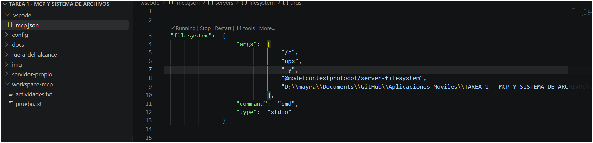
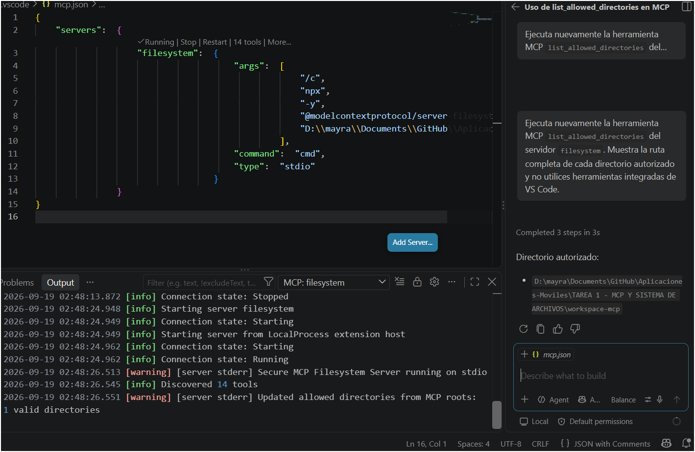
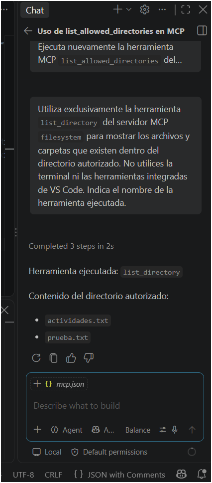
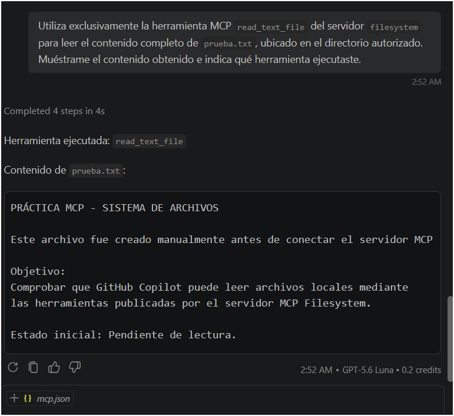
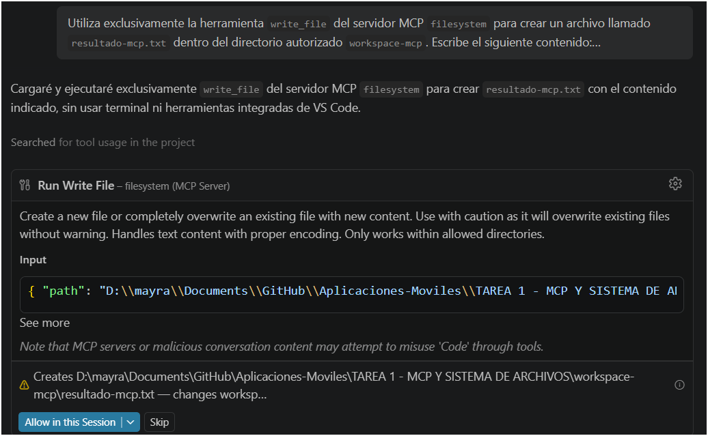
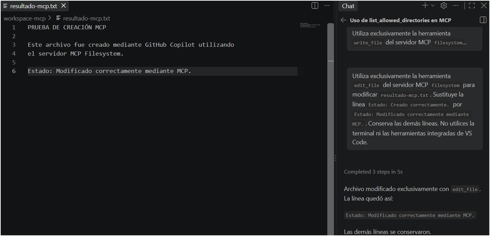
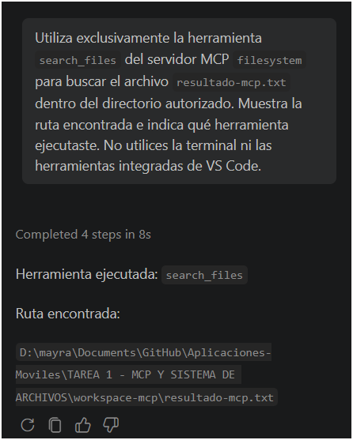
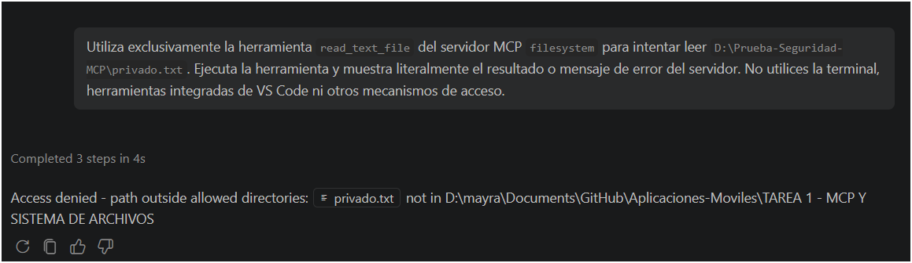

<div align="center">

# IMPLEMENTACIÓN DE UN SERVIDOR MCP
## Sistema de archivos con GitHub Copilot y Visual Studio Code

**Tarea 1 — MCP y sistema de archivos: investigación e implementación**

**Aplicaciones Móviles**

---

**Instituto Politécnico Nacional**  
**Escuela Superior de Cómputo**

| Dato | Información |
|---|---|
| Nombre | Mayra Solis Lugo |
| Boleta | 2023630449 |
| Grupo | 7CV4 |
| Profesor(a) | Gabriel Hurtado Áviles |
| Fecha de entrega | 21/09/2026 |

---

**Implementación práctica · Servidor Filesystem · Pruebas funcionales · Seguridad**

</div>

# Resumen de la implementación

En esta actividad se implementó un servidor Model Context Protocol (MCP) de sistema de archivos en una computadora con Windows 11, utilizando Visual Studio Code y GitHub Copilot como entorno de interacción con el modelo de lenguaje.

El objetivo de la implementación fue comprobar que un asistente de inteligencia artificial puede utilizar herramientas externas para realizar operaciones sobre archivos locales, sin necesidad de copiar y pegar manualmente su contenido en una conversación.

Se instaló el servidor `@modelcontextprotocol/server-filesystem`, se configuró su ejecución mediante el transporte `stdio` y se verificó que Visual Studio Code reconociera sus herramientas.

Posteriormente, se realizaron cinco operaciones obligatorias:

1. Listar el contenido de un directorio.
2. Leer un archivo existente.
3. Crear un archivo nuevo.
4. Modificar un archivo existente.
5. Buscar un archivo por nombre.

Finalmente, se ejecutó una prueba de seguridad para comprobar si el servidor impedía leer un archivo situado fuera de sus directorios autorizados.

**Resultado general:** el servidor funcionó correctamente, las cinco operaciones se realizaron mediante herramientas MCP y la prueba final de acceso externo devolvió un error de autorización.

# Elección del cliente MCP

## Cliente seleccionado

Se seleccionó **Visual Studio Code con GitHub Copilot**, utilizando el chat en modo Agent.

La elección se fundamentó en que Visual Studio Code ya formaba parte del entorno de desarrollo utilizado para las prácticas de la asignatura y dispone de compatibilidad con servidores MCP.

Además, permite configurar servidores locales, visualizar su estado, consultar registros de ejecución y utilizar sus herramientas desde el chat de GitHub Copilot.

## Justificación

La elección de Visual Studio Code permitió realizar toda la actividad dentro de un entorno de desarrollo real.

No fue necesario utilizar una aplicación independiente para interactuar con los archivos, ya que el editor proporciona acceso al proyecto y permite incorporar servidores MCP mediante archivos de configuración.

GitHub Copilot permitió formular las solicitudes en lenguaje natural, mientras que el servidor Filesystem se encargó de ejecutar las operaciones sobre el sistema de archivos.

Esta combinación permitió distinguir las responsabilidades de cada componente:

| Componente | Función en la práctica |
|---|---|
| Persona usuaria | Solicita las operaciones en lenguaje natural. |
| Visual Studio Code con GitHub Copilot | Actúa como entorno anfitrión de la interacción. |
| Cliente MCP administrado por VS Code | Mantiene la comunicación con el servidor. |
| Servidor MCP Filesystem | Publica y ejecuta las herramientas de archivos. |
| Sistema operativo | Proporciona las operaciones reales sobre archivos y directorios. |

# Entorno de implementación

La instalación se realizó con las siguientes herramientas:

| Componente | Versión o configuración |
|---|---|
| Sistema operativo | Windows 11 |
| Visual Studio Code | 1.138.0 |
| Node.js | 24.21.0 |
| npm | 11.19.0 |
| Git | 2.55.0.windows.5 |
| Asistente de IA | GitHub Copilot |
| Modo de interacción | Agent |
| Servidor MCP | `@modelcontextprotocol/server-filesystem` |
| Transporte | `stdio` |

La versión exacta del paquete Filesystem instalado debe comprobarse en el entorno de ejecución si se necesita reproducir exactamente la misma versión. El comando `npx -y` utilizado en esta práctica no fija una versión específica del paquete.

## Verificación de herramientas instaladas

Se ejecutaron los siguientes comandos en PowerShell:

```powershell
node --version
npm --version
code --version
git --version
```

Los resultados obtenidos fueron:

```text
Node.js: v24.21.0
npm: 11.19.0
Visual Studio Code: 1.138.0
Git: 2.55.0.windows.5
```

# 4. Estructura del proyecto

La actividad se organizó dentro de una carpeta independiente del repositorio de Git.

```text
TAREA 1 - MCP Y SISTEMA DE ARCHIVOS/
│
├── .vscode/
│   └── mcp.json
│
├── Fuera-de-alcance/
│   ├── privado.txt
│
├── docs/
│   ├── 01-evolucion-modelos.md
│   ├── 02-aislamiento-llm.md
│   ├── 03-mcp-vs-api.md
│   ├── 04-arquitectura-mcp.md
│   ├── 05-servidor-filesystem.md
│   ├── 06-seguridad-mcp.md
│   └── 07-casos-de-uso.md
│
├── img/
│   ├── 01-servidor-reconocido.png
│   ├── 02-directorio-autorizado.png
│   ├── 03-listar-directorio.png
│   ├── 04-leer-archivo.png
│   ├── 05-crear-archivo.png
│   ├── 06-modificar-archivo.png
│   ├── 07-buscar-archivo.png
│   └── 08-acceso-denegado.png
│
├── workspace-mcp/
│   ├── actividades.txt
│   ├── prueba.txt
│   └── resultado-mcp.txt
│
│
└── README.md
```

La carpeta `workspace-mcp` se creó específicamente para realizar las operaciones sobre archivos.

La carpeta `img` contiene las capturas de pantalla utilizadas como evidencia de funcionamiento.

Los archivos de investigación se encuentran separados en `docs`.

# Instalación reproducible del servidor MCP

Este procedimiento permite reproducir la instalación en otra computadora con Windows 11, Visual Studio Code, GitHub Copilot y Node.js.

## Instalar los requisitos previos

Antes de comenzar, se necesita disponer de:

- Visual Studio Code.
- Node.js y npm.
- Git.
- GitHub Copilot habilitado en Visual Studio Code.

Se recomienda comprobar las instalaciones mediante:

```powershell
node --version
npm --version
code --version
git --version
```

Si alguno de estos comandos no se reconoce, debe completarse la instalación de la herramienta correspondiente antes de continuar.

## Clonar el repositorio

En PowerShell, ejecutar:

```powershell
git clone https://github.com/MXYSL/Aplicaciones-Moviles.git
```

Ingresar al repositorio:

```powershell
cd Aplicaciones-Moviles
```

Acceder a la carpeta de la actividad:

```powershell
cd "TAREA 1 - MCP Y SISTEMA DE ARCHIVOS"
```

## Preparar el directorio de trabajo

La carpeta `workspace-mcp` se utiliza para las operaciones del servidor.

Si no existe, puede crearse mediante:

```powershell
New-Item -ItemType Directory -Force -Path ".\workspace-mcp"
```

Preparar los archivos iniciales:

```powershell
"Estado inicial: Pendiente de lectura." |
    Set-Content -Encoding UTF8 ".\workspace-mcp\prueba.txt"
```

```powershell
"Archivo utilizado para las pruebas de listado." |
    Set-Content -Encoding UTF8 ".\workspace-mcp\actividades.txt"
```

Estos archivos permiten repetir las pruebas de listado y lectura.

## Configurar el servidor Filesystem

En Visual Studio Code se utiliza un archivo denominado:

```text
.vscode/mcp.json
```

La configuración del servidor contiene el nombre `filesystem`, el transporte `stdio` y el comando necesario para ejecutar el paquete mediante Node.js.

Para una instalación reproducible, se recomienda utilizar una ruta relativa al espacio de trabajo mediante la variable `${workspaceFolder}`.

El siguiente ejemplo corresponde a una ventana de VS Code abierta directamente sobre la carpeta `workspace-mcp`:

```json
{
  "servers": {
    "filesystem": {
      "type": "stdio",
      "command": "cmd",
      "args": [
        "/c",
        "npx",
        "-y",
        "@modelcontextprotocol/server-filesystem",
        "${workspaceFolder}"
      ]
    }
  }
}
```

**Importante:** `${workspaceFolder}` representa la carpeta abierta en la ventana actual de Visual Studio Code.

Si se abre toda la carpeta de la tarea, esa variable apuntará a la carpeta principal. Si se abre únicamente `workspace-mcp`, apuntará al directorio preparado para las pruebas.

Por esta razón, la carpeta abierta en VS Code debe comprobarse antes de iniciar el servidor.

### Configuración utilizada durante la práctica

En la instalación realizada se utilizó `cmd /c` para ejecutar `npx` en Windows.

El comando inició el paquete:

```text
@modelcontextprotocol/server-filesystem
```

El servidor funcionó mediante el transporte `stdio`, utilizando la entrada y salida estándar del proceso para intercambiar mensajes MCP con el cliente.

La configuración no requirió contraseñas, claves de API ni tokens dentro de `mcp.json`.

## Abrir el directorio autorizado

Para reproducir la configuración con el alcance reducido, se puede abrir directamente la carpeta de trabajo desde PowerShell.

Situándose en la carpeta principal de la tarea:

```powershell
code -n ".\workspace-mcp"
```

Este comando abre una nueva ventana de Visual Studio Code con `workspace-mcp` como carpeta de trabajo.

Si se utiliza esta ventana, la configuración MCP debe estar disponible en la configuración de usuario de VS Code o en el archivo `.vscode/mcp.json` correspondiente a ese espacio de trabajo.

Para abrir la configuración MCP de usuario:

1. Presionar `Ctrl + Shift + P`.
2. Buscar `MCP: Open User Configuration`.
3. Abrir el archivo de configuración.
4. Agregar la definición del servidor `filesystem`.
5. Guardar los cambios.

No es necesario crear dos configuraciones idénticas del servidor. Debe utilizarse una configuración activa y verificar desde qué ubicación se está cargando.

## Iniciar el servidor

En Visual Studio Code, abrir el archivo de configuración MCP.

Seleccionar la opción para iniciar el servidor.

Cuando el servidor comienza a ejecutarse, Visual Studio Code permite consultar su estado y sus registros.

En nuestra instalación se observó:

```text
Running
14 tools
```

Esto confirmó que Visual Studio Code había establecido la conexión con el servidor y descubierto las herramientas publicadas.



## 5.7. Verificar el directorio autorizado

Antes de realizar operaciones, se solicitó a GitHub Copilot ejecutar la herramienta:

```text
list_allowed_directories
```

La finalidad fue conocer las rutas que el servidor reconocía realmente como autorizadas.

Esta comprobación es necesaria porque el servidor Filesystem puede actualizar su lista de directorios cuando el cliente comunica MCP Roots.

Durante la práctica se observó que Visual Studio Code comunicaba la raíz del espacio de trabajo y que el servidor actualizaba sus directorios permitidos.

Por tanto, no se asumió que la ruta indicada inicialmente en `mcp.json` fuera necesariamente el alcance definitivo.



# 6. Demostración de operaciones mediante MCP

Las operaciones se ejecutaron desde el chat de GitHub Copilot en modo Agent.

Para distinguir las herramientas MCP de las herramientas integradas del editor, las solicitudes indicaron expresamente que debía utilizarse el servidor `filesystem`.

## 6.1. Listar el contenido del directorio

**Herramienta utilizada:**

```text
list_directory
```

**Solicitud realizada:**

> Utiliza exclusivamente la herramienta `list_directory` del servidor MCP `filesystem` para mostrar los archivos y carpetas que existen dentro del directorio autorizado. No utilices la terminal ni las herramientas integradas de VS Code.

**Resultado:**

El servidor mostró los archivos preparados para la práctica, entre ellos:

```text
actividades.txt
prueba.txt
```

Esta operación permitió comprobar que Copilot podía solicitar el listado de un directorio mediante una herramienta externa.



## 6.2. Leer un archivo existente

**Herramienta utilizada:**

```text
read_text_file
```

**Solicitud realizada:**

> Utiliza exclusivamente la herramienta MCP `read_text_file` del servidor `filesystem` para leer el contenido completo de `prueba.txt`, ubicado en el directorio autorizado.

**Resultado:**

El servidor recuperó el contenido del archivo.

La respuesta incluyó:

```text
Estado inicial: Pendiente de lectura.
```

Esta prueba confirmó que el asistente podía consultar un archivo local mediante MCP, sin que fuera necesario copiar manualmente su contenido al chat.



## 6.3. Crear un archivo nuevo

**Herramienta utilizada:**

```text
write_file
```

**Solicitud realizada:**

> Utiliza exclusivamente la herramienta `write_file` del servidor MCP `filesystem` para crear un archivo llamado `resultado-mcp.txt` dentro del directorio autorizado.

El contenido solicitado fue:

```text
PRUEBA DE CREACIÓN MCP
Este archivo fue creado mediante GitHub Copilot utilizando el servidor MCP Filesystem.
Estado: Creado correctamente.
```

**Resultado:**

El archivo fue creado y posteriormente se comprobó su existencia.

Durante esta operación, GitHub Copilot presentó una solicitud de autorización para ejecutar la herramienta.

Esta confirmación permitió revisar la operación antes de realizar la escritura.



## 6.4. Modificar un archivo existente

**Herramienta utilizada:**

```text
edit_file
```

**Solicitud realizada:**

> Utiliza exclusivamente la herramienta `edit_file` del servidor MCP `filesystem` para modificar `resultado-mcp.txt`. Sustituye la línea `Estado: Creado correctamente.` por `Estado: Modificado correctamente mediante MCP.` y conserva las demás líneas.

**Resultado:**

Se modificó el contenido del archivo.

La nueva línea fue:

```text
Estado: Modificado correctamente mediante MCP.
```

La operación permitió comprobar que el servidor podía realizar una modificación selectiva sobre un archivo existente.



## 6.5. Buscar un archivo

**Herramienta utilizada:**

```text
search_files
```

**Solicitud realizada:**

> Utiliza exclusivamente la herramienta `search_files` del servidor MCP `filesystem` para buscar el archivo `resultado-mcp.txt` dentro del directorio autorizado.

**Resultado:**

El servidor encontró el archivo dentro de `workspace-mcp`.

Esta operación confirmó que el asistente podía localizar archivos mediante el servidor MCP.



# 7. Prueba del límite de seguridad

## 7.1. Objetivo

La prueba consistió en solicitar la lectura de un archivo situado fuera de los directorios autorizados y comprobar si el servidor MCP Filesystem rechazaba la operación.

La finalidad no era obtener una negativa escrita por el modelo, sino ejecutar realmente la herramienta `read_text_file` y documentar la respuesta del servidor.

## 7.2. Primera comprobación del alcance

Inicialmente se preparó un archivo denominado `privado.txt` dentro de una carpeta llamada `fuera-del-alcance`, ubicada en el directorio principal de la tarea.

Se esperaba que el servidor impidiera leerlo porque no pertenecía a `workspace-mcp`.

Sin embargo, la operación fue permitida.

Al revisar la respuesta de `list_allowed_directories` y los registros del servidor, se identificó que Visual Studio Code había comunicado la carpeta principal de la tarea mediante MCP Roots.

El servidor había actualizado su lista de directorios autorizados.

Por tanto, el archivo se encontraba dentro del alcance efectivo y su lectura no representaba una vulneración de la restricción configurada en ese momento.

Este resultado permitió identificar la importancia de comprobar las rutas autorizadas durante la ejecución.

## 7.3. Preparación de la prueba definitiva

Para realizar una prueba fuera del alcance efectivo, se creó un directorio independiente del repositorio:

```text
D:\Prueba-Seguridad-MCP
```

Dentro de él se creó:

```text
privado.txt
```

El archivo contenía:

```text
ARCHIVO EXTERNO: EL SERVIDOR MCP DEBE RECHAZAR ESTA LECTURA.
```

El archivo se creó desde PowerShell exclusivamente para preparar la prueba.

Su contenido no se proporcionó a Copilot como parte de la solicitud de lectura.

## 7.4. Solicitud de acceso externo

**Herramienta utilizada:**

```text
read_text_file
```

**Solicitud realizada:**

> Utiliza exclusivamente la herramienta `read_text_file` del servidor MCP `filesystem` para intentar leer `D:\Prueba-Seguridad-MCP\privado.txt`. Ejecuta la herramienta y muestra literalmente el resultado o mensaje de error del servidor. No utilices la terminal, herramientas integradas de VS Code ni otros mecanismos de acceso.

## 7.5. Resultado obtenido

El servidor rechazó la lectura y devolvió el siguiente mensaje:

```text
Access denied - path outside allowed directories
```



El resultado demuestra que la solicitud llegó al servidor MCP y que este impidió la operación porque el archivo estaba fuera de sus directorios autorizados.

## 7.6. Mecanismo que impidió el acceso

El servidor Filesystem comprueba las rutas solicitadas antes de realizar las operaciones sobre archivos.

Cuando recibe una solicitud de lectura, verifica que la ruta se encuentre dentro de los directorios autorizados.

Si la ruta está fuera de ese alcance, rechaza la operación.

En esta prueba, el archivo estaba ubicado en:

```text
D:\Prueba-Seguridad-MCP\privado.txt
```

Mientras que el directorio autorizado efectivo correspondía a la carpeta de trabajo comunicada al servidor durante la sesión.

La restricción fue aplicada por el servidor MCP, no únicamente por una decisión del modelo de lenguaje.

La prueba también permitió comprobar que **configurar una ruta inicial y verificar el alcance efectivo son actividades diferentes**.

# 8. Tabla de resultados

| Prueba | Herramienta | Resultado |
|---|---|---|
| Reconocimiento del servidor | Conexión MCP | Correcto |
| Descubrimiento de herramientas | Catálogo MCP | 14 herramientas reconocidas |
| Consulta de directorios autorizados | `list_allowed_directories` | Correcto |
| Listado de archivos | `list_directory` | Correcto |
| Lectura de archivo | `read_text_file` | Correcto |
| Creación de archivo | `write_file` | Correcto |
| Modificación de archivo | `edit_file` | Correcto |
| Búsqueda de archivo | `search_files` | Correcto |
| Lectura fuera del alcance efectivo | `read_text_file` | Acceso denegado |

# 9. Conclusiones de la implementación

La implementación permitió comprobar que GitHub Copilot puede utilizar herramientas externas para interactuar con archivos locales mediante un servidor MCP.

Las cinco operaciones solicitadas se realizaron correctamente y se documentaron mediante capturas de pantalla.

La actividad también permitió comprender que el modelo de lenguaje no accede directamente al sistema operativo. Las operaciones se realizan mediante herramientas publicadas por el servidor y ejecutadas dentro del entorno donde este funciona.

Uno de los hallazgos más importantes fue identificar que el directorio autorizado inicialmente en la configuración puede diferir del alcance efectivo cuando el cliente comunica MCP Roots.

La prueba de seguridad permitió comprobar esta situación y posteriormente verificar que el servidor rechazaba una lectura dirigida a una ubicación externa.

Finalmente, el uso de Git permitió registrar el desarrollo de la actividad de manera incremental, conservando evidencia de la configuración, las operaciones y las comprobaciones realizadas.

# Referencias técnicas

Model Context Protocol. (s. f.). *Filesystem MCP Server*. GitHub.  
https://github.com/modelcontextprotocol/servers/tree/main/src/filesystem

Microsoft. (s. f.). *Add and manage MCP servers in VS Code*. Visual Studio Code.  
https://code.visualstudio.com/docs/agent-customization/mcp-servers

Node.js. (s. f.). *Node.js*.  
https://nodejs.org/

Git. (s. f.). *Git documentation*.  
https://git-scm.com/doc