<div align="center">

# 🍃 FoodLab

## Implementación con Flutter

### Tarea 2 · Elementos Básicos de Interfaz de Usuario

**Desarrollo de Aplicaciones Móviles Nativas**

<br>


<br>

### *Explora, prepara y organiza tus recetas.*


</div>

---

# 📱 Descripción

Esta carpeta contiene la implementación de **FoodLab desarrollada con Flutter y Dart** para la Tarea 2 de la materia Desarrollo de Aplicaciones Móviles Nativas.

FoodLab funciona como un catálogo interactivo de componentes de interfaz de usuario integrado dentro de una aplicación temática de recetas.

En lugar de presentar los widgets solicitados como ejemplos independientes, los diferentes componentes forman parte de acciones relacionadas con la creación, personalización, consulta y preparación de recetas.

La aplicación se encuentra dividida en seis secciones principales, además de una pantalla de inicio desde la cual se puede navegar hacia cada una de ellas.

El desarrollo busca mantener una interfaz consistente, interactiva y relacionada con el propósito general de FoodLab.

---

# 🎯 Objetivo de la implementación

El objetivo de esta versión es implementar el catálogo utilizando los componentes y mecanismos proporcionados por Flutter.

La aplicación permite demostrar el uso de elementos relacionados con:

- Entrada de información.
- Validación de datos.
- Botones y acciones.
- Selección de opciones.
- Listas y colecciones.
- Retroalimentación visual.
- Indicadores de progreso.
- Diálogos.
- Hojas inferiores.
- Navegación.
- Distribución de contenido.
- Manejo de imágenes.
- Manejo de estado.
- Comunicación entre diferentes pantallas.

La versión Flutter mantiene el mismo concepto que las implementaciones realizadas con Android Views/XML y Jetpack Compose.

---

# 🛠️ Tecnologías

| Tecnología | Uso |
| :--- | :--- |
| **Flutter 3.47.4** | Framework principal |
| **Dart 3.13.3** | Lenguaje de programación |
| **Material 3** | Componentes y diseño |
| **Android SDK 37** | Plataforma Android |
| **Android Studio** | Desarrollo y ejecución |
| **Flutter Test** | Pruebas de widgets |
| **Git / GitHub** | Control de versiones |

El proyecto fue probado utilizando un emulador:

```text
Pixel 8
Android 17
API 37
```

---

# 🍃 Concepto de FoodLab

FoodLab utiliza una aplicación de cocina para proporcionar contexto a los diferentes componentes de interfaz.

El flujo conceptual de la aplicación es:

```text
                    FOODLAB
                       │
                       ▼
                Pantalla principal
                       │
       ┌───────────────┼───────────────┐
       │               │               │
       ▼               ▼               ▼
 Crear receta       Preparar        Explorar
       │               │             recetas
       ▼               ▼               │
 Personalizar      Seguimiento          │
       │               │               │
       └───────────────┼───────────────┘
                       │
                       ▼
               Estado compartido
```

Una receta registrada por el usuario puede utilizarse posteriormente desde otras áreas de la aplicación.

Esto permite que los componentes demostrados tengan una relación funcional entre sí.

---

# 🎨 Diseño visual

FoodLab utiliza una identidad visual relacionada con alimentos, ingredientes y cocina.

Los colores principales son:

| Elemento | Uso |
| :--- | :--- |
| 🟢 Verde albahaca | Color principal |
| 🟠 Naranja cálido | Color secundario |
| 🟡 Tonos crema | Fondos claros |
| ⚫ Gris oscuro | Fondos del modo oscuro |

El diseño utiliza:

- Tarjetas redondeadas.
- Fotografías de alimentos.
- Iconografía Material.
- Espaciado uniforme.
- Jerarquía tipográfica.
- Componentes Material 3.
- Tema claro y oscuro.
- Distribución adaptable.

---

# 🏗️ Arquitectura general

La aplicación utiliza una organización sencilla basada en separación de responsabilidades.

```text
                        main.dart
                            │
                            ▼
                       FoodLabApp
                            │
                            ▼
                       HomeScreen
                            │
          ┌─────────────────┼─────────────────┐
          │                 │                 │
          ▼                 ▼                 ▼
       Screens           State             Theme
          │                 │                 │
          │                 ▼                 ▼
          │            RecipeStore        AppTheme
          │                 │
          ▼                 ▼
       Recipe ◄──────── Datos compartidos
          │
          ▼
     RecipeHelper
```

La aplicación separa:

- Pantallas.
- Modelo de datos.
- Estado compartido.
- Tema.
- Funciones auxiliares.
- Recursos gráficos.

---

# 📂 Estructura del proyecto

La estructura principal de la implementación es:

```text
flutter/
│
├── android/
│
├── assets/
│   └── images/
│       ├── pasta_pollo.png
│       ├── pasta.png
│       ├── ensalada.png
│       ├── sopa.png
│       ├── tacos.png
│       ├── pizza.png
│       ├── hamburguesa.png
│       ├── postre.png
│       ├── desayuno.png
│       └── receta_generica.png
│
├── lib/
│   ├── main.dart
│   │
│   ├── models/
│   │   └── recipe.dart
│   │
│   ├── screens/
│   │   ├── home_screen.dart
│   │   ├── text_input_screen.dart
│   │   ├── actions_screen.dart
│   │   ├── selection_screen.dart
│   │   ├── collections_screen.dart
│   │   ├── feedback_screen.dart
│   │   └── structure_screen.dart
│   │
│   ├── state/
│   │   └── recipe_store.dart
│   │
│   ├── theme/
│   │   └── app_theme.dart
│   │
│   └── utils/
│       └── recipe_helper.dart
│
├── test/
│   └── widget_test.dart
│
├── pubspec.yaml
└── README.md
```

---

# 🏠 Pantalla principal

La pantalla principal funciona como el centro de navegación de FoodLab.

Presenta la identidad de la aplicación, una receta destacada y seis accesos a las diferentes áreas.

Las opciones disponibles son:

1. **Crea tu receta**
2. **Acciones de cocina**
3. **Personaliza tu menú**
4. **Explora recetas**
5. **Cocina en progreso**
6. **Diseño de FoodLab**

La pantalla fue diseñada para mantener únicamente la información necesaria, evitando etiquetas técnicas dentro de la experiencia del usuario.

### Evidencia

<p align="center">
  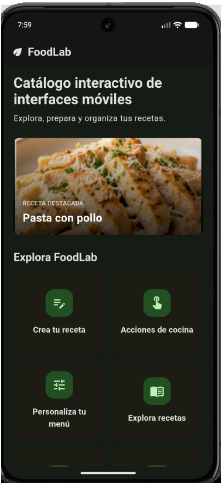
</p>

---

# ✏️ Sección 1 - Crea tu receta

Esta sección permite registrar información relacionada con una nueva receta.

Su objetivo dentro de la práctica es demostrar diferentes formas de entrada de información.

Entre las funciones implementadas se encuentran:

- Campo de texto para el nombre.
- Validación de información.
- Campo de contraseña.
- Mostrar y ocultar contraseña.
- Entrada de correo electrónico.
- Entrada telefónica.
- Entrada numérica.
- Número de porciones.
- Entrada multilínea.
- Registro de ingredientes.
- Sugerencias.
- Selección de categoría.
- Búsqueda.
- Mensajes de error.
- Confirmación del registro.

Los ingredientes pueden introducirse utilizando diferentes líneas o separándolos mediante comas.

Cuando la información es válida, FoodLab construye un objeto `Recipe` y lo almacena en `RecipeStore`.

Además, la aplicación asigna automáticamente una imagen y una serie de pasos de preparación de acuerdo con la información registrada.

### Flujo

```text
Ingresar datos
      │
      ▼
  Validación
      │
      ├── Incorrectos ──► Mostrar error
      │
      ▼
   Correctos
      │
      ▼
 Crear Recipe
      │
      ▼
 RecipeStore
      │
      ▼
Mostrar confirmación
```

### Evidencia

<p align="center">
  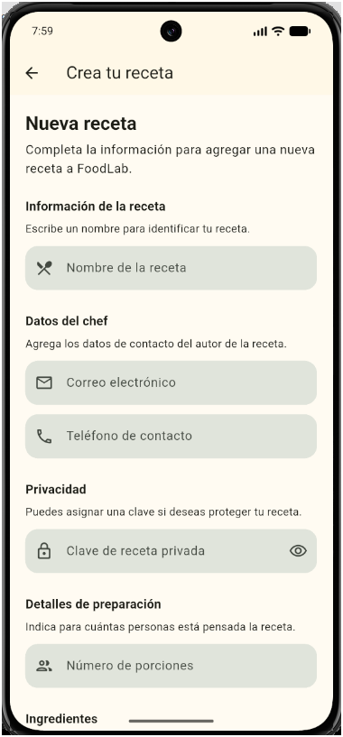
</p>

---

# 👆 Sección 2 - Acciones de cocina

Esta sección utiliza la receta registrada previamente y permite realizar diferentes acciones sobre ella.

Se implementaron diferentes estilos y estados de botones.

Entre las acciones disponibles se encuentran:

- Guardar.
- Compartir.
- Marcar como favorita.
- Iniciar preparación.
- Cambiar entre preparación y presentación.
- Agregar ingredientes.
- Eliminar ingredientes.
- Avanzar entre pasos.
- Regresar al paso anterior.
- Finalizar la preparación.

También se incluyen botones flotantes y diferentes representaciones de acciones mediante texto e iconos.

Durante determinadas operaciones se muestran estados de carga y botones deshabilitados para representar el comportamiento de una interfaz durante un proceso.

### Integración

```text
Crea tu receta
      │
      ▼
 RecipeStore
      │
      ▼
Acciones de cocina
      │
      ├── Favorita
      ├── Ingredientes
      ├── Preparación
      └── Finalización
```

### Evidencia

<p align="center">
  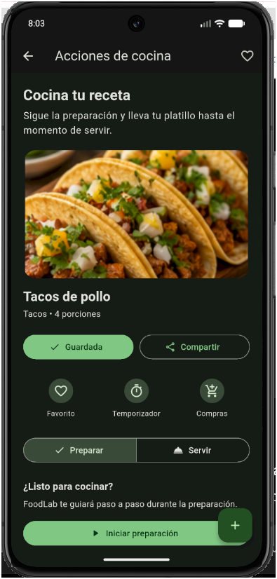
</p>

---

# 🎛️ Sección 3 - Personaliza tu menú

Esta sección agrupa diferentes mecanismos de selección.

Las opciones se presentan dentro del contexto de preferencias de alimentación y preparación.

Se implementaron:

- Casilla de verificación.
- Estado indeterminado.
- Grupo de opciones exclusivas.
- Interruptor.
- Selección de número de porciones.
- Selección de intervalo de tiempo.
- Lista desplegable.
- Selector de fecha.
- Selector de hora.
- Filtros seleccionables.

Entre las preferencias disponibles se encuentran opciones relacionadas con:

- Tipo de comida.
- Alimentación vegetariana.
- Número de porciones.
- Tiempo de preparación.
- Tipo de cocina.
- Fecha.
- Hora.
- Preferencias adicionales.

Los cambios producen una respuesta visible para confirmar las selecciones realizadas.

### Evidencia

<p align="center">
  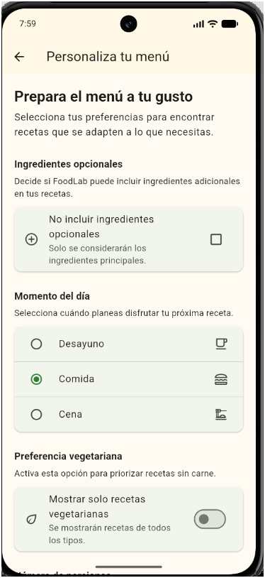
</p>

---

# 📚 Sección 4 - Explora recetas

Esta sección representa el catálogo principal de recetas.

El contenido puede visualizarse de diferentes maneras para demostrar distintas formas de presentar colecciones.

La sección contiene más de 15 recetas de demostración y también incorpora las recetas creadas por el usuario.

Se implementaron:

- Lista vertical.
- Cuadrícula.
- Secciones.
- Diferentes grupos de recetas.
- Selección de elementos.
- Vista de detalle.
- Eliminación mediante deslizamiento.
- Acción para deshacer.
- Actualización mediante gesto.
- Estado vacío.
- Colecciones horizontales.
- Pestañas.
- Contenido deslizable.

Las pestañas principales son:

```text
Recetas | Galería | Colecciones
```

Las recetas creadas por el usuario se distinguen del contenido inicial y pueden integrarse dinámicamente al catálogo.

### Eliminación

Los elementos pueden eliminarse mediante un gesto lateral.

En las recetas de demostración se ofrece la posibilidad de recuperar el elemento mediante una acción de deshacer.

### Estado vacío

Cuando no existen elementos disponibles, la interfaz presenta un estado alternativo en lugar de mostrar una colección vacía.

### Evidencia

<p align="center">
  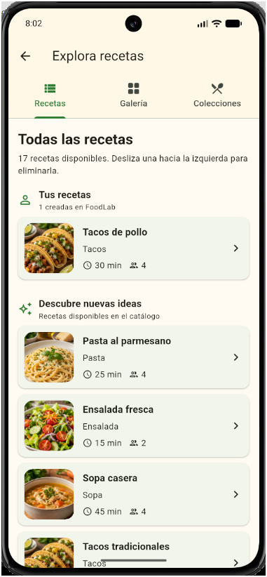
</p>

---

# ⏱️ Sección 5 - Cocina en progreso

Esta sección muestra diferentes mecanismos de información y retroalimentación.

La pantalla utiliza la receta más reciente registrada en FoodLab cuando existe una disponible.

Se implementaron:

- Texto con diferentes estilos.
- Imagen local.
- Imagen obtenida desde Internet.
- Progreso lineal determinado.
- Progreso lineal indeterminado.
- Progreso circular determinado.
- Progreso circular indeterminado.
- Mensajes temporales.
- Snackbar.
- Acción dentro del Snackbar.
- Diálogo de confirmación.
- Hoja inferior.
- Tarjetas.
- Divisores.
- Badge numérico.
- Estado de carga.
- Estado de error para recursos remotos.

## Indicadores de progreso

FoodLab presenta diferentes estados de progreso durante una preparación.

### Determinado

El valor del progreso es conocido:

```text
0% ──────────────── 50% ──────────────── 100%
```

La interfaz representa este valor mediante indicadores lineales y circulares.

### Indeterminado

Cuando una operación se encuentra activa pero no existe un porcentaje exacto, se utiliza un indicador indeterminado.

## Imagen remota

La sección incluye contenido obtenido mediante Internet utilizando `Image.network`.

Se contemplan:

- Carga del recurso.
- Indicador mientras se obtiene la imagen.
- Presentación de la imagen.
- Estado alternativo en caso de error.

Para permitir la carga del recurso, la aplicación declara acceso a Internet en la configuración Android.

### Evidencia

<p align="center">
  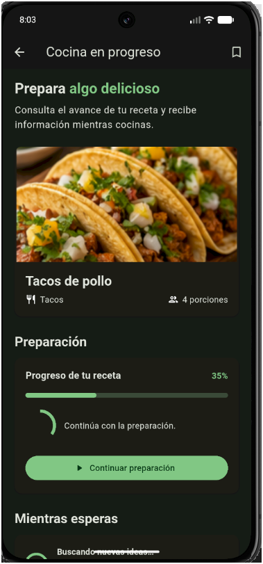
</p>

---

# 🧱 Sección 6 - Diseño de FoodLab

Esta sección demuestra diferentes formas de organizar elementos dentro de una interfaz.

Incluye:

- Distribución horizontal.
- Distribución vertical.
- Contenido superpuesto.
- Desplazamiento vertical.
- Barra superior.
- Acciones en la barra superior.
- Navegación inferior.
- Distribución proporcional.
- Contenido adaptable.

La pantalla también contiene funciones reales de FoodLab.

### Buscar

Permite consultar las recetas creadas durante la ejecución.

La búsqueda puede considerar información de la receta, como:

- Nombre.
- Categoría.
- Ingredientes.

### Favoritas

Muestra las recetas que han sido marcadas como favoritas.

### Nueva receta

Permite navegar directamente hacia la creación de una nueva receta.

### Recetas

Permite acceder al catálogo.

### Perfil

Muestra un resumen de la actividad actual de FoodLab.

### Navegación inferior

La pantalla contiene accesos a:

```text
Inicio | Recetas | Perfil
```

### Distribución proporcional

La sección utiliza diferentes proporciones de espacio para representar visualmente información nutricional.

```text
Vegetales        Proteína       Otros
   50%              30%           20%
██████████       ██████        ████
```

### Evidencia

<p align="center">
  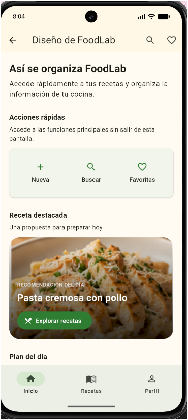
</p>

---

# 🔗 Comunicación entre secciones

FoodLab no trata las seis secciones como aplicaciones independientes.

Algunas pantallas comparten información mediante `RecipeStore`.

Un ejemplo del flujo es:

```text
┌──────────────────────┐
│   Crea tu receta     │
└──────────┬───────────┘
           │
           ▼
     ┌───────────┐
     │  Recipe   │
     └─────┬─────┘
           │
           ▼
   ┌───────────────┐
   │  RecipeStore  │
   └───────┬───────┘
           │
     ┌─────┼─────────────┬────────────────┐
     │     │             │                │
     ▼     ▼             ▼                ▼
 Acciones Explora    En progreso      Diseño
 cocina   recetas      cocina         FoodLab
```

Esto permite, por ejemplo:

1. Crear una receta.
2. Consultarla desde otras pantallas.
3. Prepararla.
4. Marcarla como favorita.
5. Encontrarla mediante búsqueda.
6. Mostrarla dentro de colecciones.

---

# 📦 Modelo de datos

La información de una receta se representa mediante la clase:

```text
Recipe
```

Entre sus datos se encuentran:

```text
Recipe
│
├── id
├── name
├── email
├── phone
├── password
├── portions
├── ingredients
├── category
├── imagePath
├── steps
├── isFavorite
├── isSaved
└── isFinished
```

Además de la información capturada, la receta mantiene estados que pueden modificarse durante el uso de la aplicación.

---

# 🔄 Administración del estado

El estado compartido se concentra en:

```text
RecipeStore
```

Este componente administra las recetas durante la ejecución de FoodLab.

Entre sus operaciones se encuentran:

- Agregar recetas.
- Eliminar recetas.
- Obtener la receta más reciente.
- Marcar favoritos.
- Guardar cambios.
- Finalizar preparaciones.
- Agregar ingredientes.
- Eliminar ingredientes.
- Notificar cambios a las pantallas.

La aplicación utiliza `ChangeNotifier` para informar a las interfaces cuando existen modificaciones.

> **Nota:** los datos se mantienen durante la ejecución actual de la aplicación. Esta implementación no utiliza una base de datos permanente.

---

# 🖼️ Asignación de imágenes

FoodLab utiliza `RecipeHelper` para relacionar automáticamente determinados tipos de receta con recursos gráficos.

Por ejemplo:

| Contenido identificado | Imagen |
| :--- | :--- |
| Pasta con pollo | `pasta_pollo.png` |
| Pasta | `pasta.png` |
| Ensalada | `ensalada.png` |
| Sopa | `sopa.png` |
| Tacos | `tacos.png` |
| Pizza | `pizza.png` |
| Hamburguesa | `hamburguesa.png` |
| Postre | `postre.png` |
| Desayuno | `desayuno.png` |
| Otro contenido | `receta_generica.png` |

Cuando una receta no coincide con una categoría conocida se utiliza una imagen genérica.

---

# 🖼️ Recursos gráficos

Las imágenes utilizadas localmente se encuentran en:

```text
assets/images/
```

## Pasta con pollo

<p align="center">
  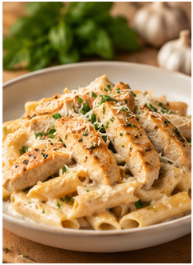
</p>

## Pasta

<p align="center">
  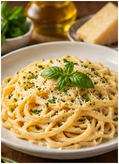
</p>

## Ensalada

<p align="center">
  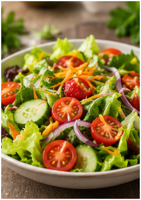
</p>

## Sopa

<p align="center">
  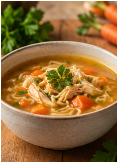
</p>

## Tacos

<p align="center">
  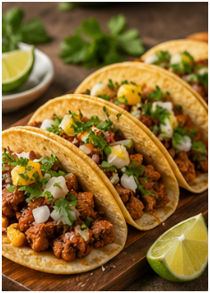
</p>

## Pizza

<p align="center">
  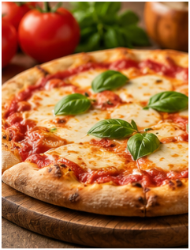
</p>

## Hamburguesa

<p align="center">
  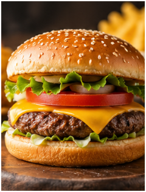
</p>

## Postre

<p align="center">
  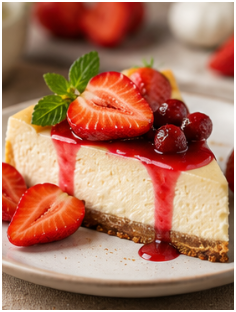
</p>

## Desayuno

<p align="center">
  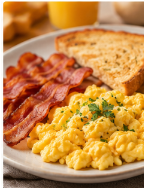
</p>

## Receta genérica

<p align="center">
  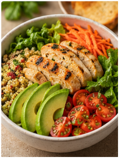
</p>

---

# 🌗 Tema claro y oscuro

FoodLab utiliza:

```dart
themeMode: ThemeMode.system
```

Esto permite que la aplicación adopte automáticamente el modo configurado en el dispositivo.

La configuración se concentra en:

```text
lib/theme/app_theme.dart
```

La versión clara utiliza tonos cálidos y verdes, mientras que la versión oscura utiliza superficies oscuras manteniendo el contraste de los elementos principales.

```text
Sistema
   │
   ├── Tema claro ──► FoodLab claro
   │
   └── Tema oscuro ─► FoodLab oscuro
```

---

# 🧭 Navegación

La pantalla principal utiliza `Navigator` para acceder a las diferentes áreas.

El flujo general es:

```text
                    HomeScreen
                        │
       ┌────────────────┼────────────────┐
       │                │                │
       ▼                ▼                ▼
Crea tu receta     Acciones         Personaliza
       │             cocina            menú
       │
       ├─────────────┐
       │             │
       ▼             ▼
    Explora       Cocina en
    recetas        progreso
       │
       ▼
Diseño de FoodLab
```

Cada pantalla permite regresar mediante el mecanismo estándar de navegación de Android/Flutter.

---

# ✔️ Validaciones

FoodLab valida diferentes datos antes de registrar una receta.

El objetivo es impedir que información incompleta o inválida se incorpore al estado compartido.

El flujo general es:

```text
Formulario
    │
    ▼
Validación
    │
 ┌──┴──────────────┐
 │                 │
 ▼                 ▼
Error            Correcto
 │                 │
 ▼                 ▼
Mensaje       Crear receta
                   │
                   ▼
              RecipeStore
```

---

# 💬 Retroalimentación al usuario

La aplicación utiliza diferentes mecanismos para informar sobre el resultado de una acción.

Entre ellos se encuentran:

- Mensajes de validación.
- Snackbars.
- Acciones para deshacer.
- Diálogos.
- Hojas inferiores.
- Indicadores de carga.
- Indicadores de progreso.
- Estados vacíos.
- Estados de error.
- Cambios visuales en controles.

Esto permite que el usuario conozca el estado de la aplicación después de realizar una interacción.

---

# ⚙️ Requisitos de ejecución

Para trabajar con esta implementación se requiere:

- Flutter SDK.
- Dart SDK.
- Android SDK.
- Android Studio o un editor compatible.
- Emulador Android o dispositivo físico.
- Git para control de versiones.

La versión utilizada durante el desarrollo fue:

```text
Flutter 3.47.4
Dart 3.13.3
Android SDK 37
```

---

# ▶️ Ejecución

## 1. Abrir una terminal

Ubicarse en la carpeta:

```text
TAREA 2 - ELEMENTOS BASICOS DE INTERFAZ/flutter
```

## 2. Obtener dependencias

```bash
flutter pub get
```

## 3. Comprobar dispositivos

```bash
flutter devices
```

## 4. Ejecutar

```bash
flutter run
```

También se puede indicar un dispositivo específico:

```bash
flutter run -d <device-id>
```

---

# 🧪 Pruebas

Antes de generar el APK se realizaron diferentes comprobaciones.

## Análisis estático

```bash
flutter analyze
```

Resultado final:

```text
No issues found!
```

## Prueba de widgets

El proyecto contiene:

```text
test/widget_test.dart
```

La prueba verifica elementos principales de la pantalla inicial de FoodLab.

Puede ejecutarse mediante:

```bash
flutter test
```

El proyecto fue validado antes de generar el APK final.

---

# 📲 Generación del APK

Para generar la aplicación en modo release se utilizó:

```bash
flutter build apk --release
```

Flutter genera el archivo en:

```text
build/app/outputs/flutter-apk/app-release.apk
```

El APK final fue copiado al directorio general de entregables con el nombre:

```text
FoodLab-Flutter.apk
```

Ubicación dentro de la Tarea 2:

```text
TAREA 2 - ELEMENTOS BASICOS DE INTERFAZ/
└── apk/
    └── FoodLab-Flutter.apk
```

El APK generado tiene un tamaño aproximado de:

```text
53.4 MB
```

---

# 📸 Evidencias

Las evidencias de la versión Flutter se almacenan en:

```text
docs/flutter/
```

Se propone utilizar la siguiente nomenclatura:

```text
docs/flutter/
│
├── 00_inicio.png
├── 01_crea_tu_receta.png
├── 02_acciones_cocina.png
├── 03_personaliza_menu.png
├── 04_explora_recetas.png
├── 05_cocina_progreso.png
└── 06_diseno_foodlab.png
```

## Vista general

<table>
<tr>
<td align="center">
<b>Inicio</b><br><br>

</td>
<td align="center">
<b>Crea tu receta</b><br><br>

</td>
<td align="center">
<b>Acciones de cocina</b><br><br>

</td>
</tr>

<tr>
<td align="center">
<b>Personaliza tu menú</b><br><br>

</td>
<td align="center">
<b>Explora recetas</b><br><br>

</td>
<td align="center">
<b>Cocina en progreso</b><br><br>

</td>
</tr>

<tr>
<td align="center" colspan="3">
<b>Diseño de FoodLab</b><br><br>

</td>
</tr>
</table>

---

# 📋 Resumen de implementación

| Área | Implementación |
| :--- | :---: |
| Pantalla principal | ✅ |
| Crea tu receta | ✅ |
| Acciones de cocina | ✅ |
| Personaliza tu menú | ✅ |
| Explora recetas | ✅ |
| Cocina en progreso | ✅ |
| Diseño de FoodLab | ✅ |
| Navegación entre pantallas | ✅ |
| Estado compartido | ✅ |
| Imágenes locales | ✅ |
| Imagen desde Internet | ✅ |
| Tema claro y oscuro | ✅ |
| Validación de formularios | ✅ |
| Retroalimentación visual | ✅ |
| Prueba de widgets | ✅ |
| Análisis estático | ✅ |
| APK release | ✅ |

---

# 🍃 FoodLab

<div align="center">

**Mayra Solis Lugo**  
Escuela Superior de Cómputo  
</div>
